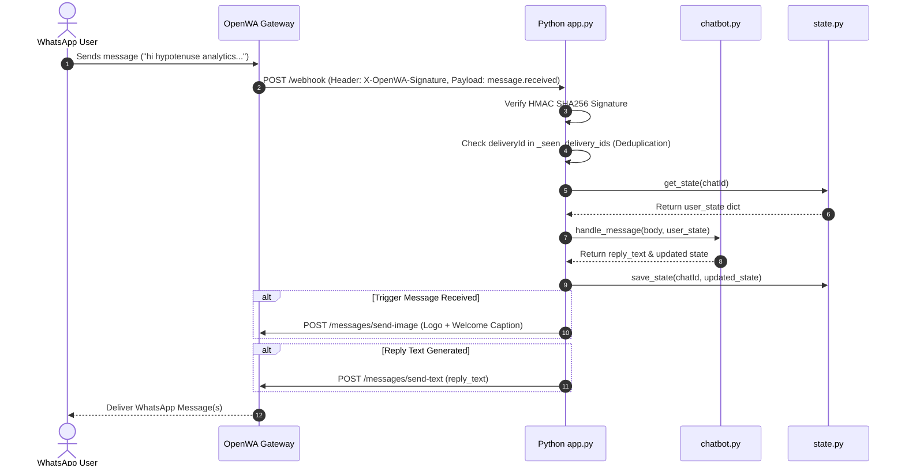
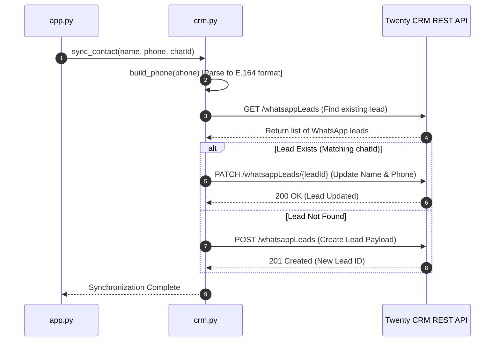
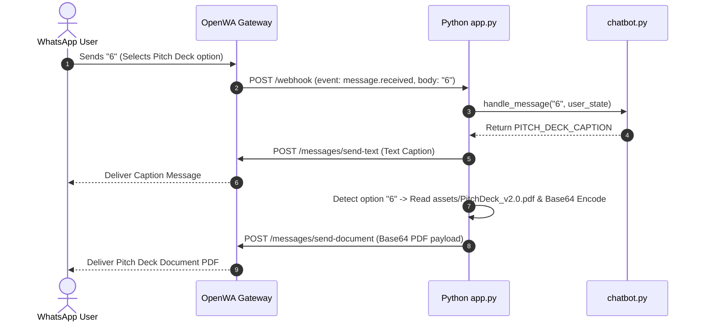

## 📌 Architecture Overview
The **OpenWA_Backend** is a Python microservice built using **Flask**. It acts as the intelligent orchestration layer for OpenWA. It receives real-time webhook events from OpenWA, processes interactive multi-stage conversation flows, enforces stateless session timeouts, sends rich media (logos and PDF documents), and automatically synchronizes incoming contact details into **Twenty CRM**.

---

## 📁 File Structure & Component Responsibilities

```
OpenWA_Backend/
├── assets/
│   ├── hypotenuse_logo.png         # Image sent upon session initiation
│   └── PitchDeck_v2.0.pdf          # PDF pitch deck sent during chatbot flow
├── app.py                          # Main Flask application, Webhook receiver & HTTP API sender
├── chatbot.py                      # Menu navigation & deterministic chatbot state machine logic
├── config.py                       # Global configs, menu texts, timeouts & env vars
├── crm.py                          # Twenty CRM SDK wrapper & E.164 phone number parser
├── state.py                        # Thread-safe user session state manager with JSON disk persistence
├── users.json                      # Persistent disk storage mapping user chat IDs to state
└── requirements.txt                # Python dependencies (Flask, requests, phonenumbers)
```

### Component Details
- **[app.py](file:///c:/Users/raksh/Documents/Hypotenuse-Analytics/OpenWA/OpenWA_Backend/app.py)**: Exposes `/webhook` and `/health` endpoints. Responsible for HMAC signature verification (`X-OpenWA-Signature`), deduplication of webhook deliveries (`_seen_delivery_ids`), parsing payloads, triggering CRM syncs asynchronously, and executing REST calls back to OpenWA to deliver messages/media.
- **[chatbot.py](file:///c:/Users/raksh/Documents/Hypotenuse-Analytics/OpenWA/OpenWA_Backend/chatbot.py)**: Core state engine. Evaluates incoming text against active user stage. Handles website trigger activation (`TRIGGER_MESSAGE`), global navigation keywords (`menu`, `0`), option selection (1-7), and returns corresponding response content.
- **[crm.py](file:///c:/Users/raksh/Documents/Hypotenuse-Analytics/OpenWA/OpenWA_Backend/crm.py)**: Integration wrapper for Twenty CRM. Handles searching existing leads (`find_by_chat`), creation (`create_lead`), updates (`update_lead`), and phone number standardization (`build_phone`).
- **[state.py](file:///c:/Users/raksh/Documents/Hypotenuse-Analytics/OpenWA/OpenWA_Backend/state.py)**: Thread-safe state tracking (`threading.Lock()`) backed by `users.json`. Automatically resets stale user sessions after `IDLE_TIMEOUT_SECONDS` (15 mins).
- **[config.py](file:///c:/Users/raksh/Documents/Hypotenuse-Analytics/OpenWA/OpenWA_Backend/config.py)**: Central configuration loading environment variables (`OPENWA_BASE_URL`, `OPENWA_API_KEY`, `TWENTY_API_KEY`, `WEBHOOK_SECRET`) and housing raw menu strings.

---

## 💼 Twenty CRM Integration

### 1. International Phone Resolution & Parsing
Uses Google's `phonenumbers` library inside `build_phone()`:
- Converts WhatsApp sender strings (e.g. `919876543210`) into international E.164 standard.
- Formats payload according to Twenty CRM's `Phone` composite field structure:
```json
{
  "primaryPhoneNumber": "9876543210",
  "primaryPhoneCallingCode": "+91",
  "primaryPhoneCountryCode": "IN",
  "additionalPhones": []
}
```

### 2. Lead Synchronization & Duplicate Handling
- **Lookup**: Queries Twenty CRM's `/whatsappLeads` endpoint by matching `chatId`.
- **Create vs. Update**:
  - If no lead matches `chatId`, `create_lead()` posts a new lead payload.
  - If a lead exists, `update_lead()` issues a HTTP `PATCH` to update contact fields without introducing duplicates.

---

## 🤖 Chatbot State Engine Mechanics

### Session Activation & Flow
1. **Trigger Activation**: The session begins **only** when the user sends the exact `TRIGGER_MESSAGE` (e.g. sent from website WhatsApp button).
2. **State Machine Stages**:
   - `main_menu`: Main option prompt (Options 1-7).
   - `about_us`: Option 1 response.
   - `products_menu`: Option 2 sub-menu.
   - `critical_infrastructure`: Option 3 detailed breakdown.
   - `surveillance`: Option 4 detailed breakdown.
   - `reality_trust`: Option 5 detailed breakdown.
   - `pitch_deck`: Option 6 triggers text reply + document dispatch (`PitchDeck_v2.0.pdf`).
   - `contact_support`: Option 7 support details.
3. **Idle Expiration**: If `time.time() - last_seen > 900s`, `state.get_state()` resets user to `main_menu` on their next interaction.

---

## 🛡️ Production & Security Guidelines

- **HMAC Signature Verification**: All inbound webhooks must match the HMAC SHA-256 signature calculated over raw payload bytes using `WEBHOOK_SECRET`.
- **Webhook Deduplication**: Webhooks retain an in-memory set `_seen_delivery_ids` to discard duplicate `deliveryId` payloads delivered by OpenWA's at-least-once delivery guarantee.
- **Environment Variables**:
  - `OPENWA_BASE_URL`: Base URL of OpenWA API (Default: `http://localhost:2785`).
  - `OPENWA_API_KEY`: API Key for OpenWA authorization header `X-API-Key`.
  - `OPENWA_SESSION_ID`: Targeted OpenWA WhatsApp session ID.
  - `WEBHOOK_SECRET`: Secret used to compute HMAC SHA-256 signatures.
  - `TWENTY_BASE_URL`: Twenty CRM REST API base URL.
  - `TWENTY_API_KEY`: Twenty CRM Bearer token.

---

## 📊 Sequence Diagrams

### 1. Incoming Message & Chatbot Processing Flow



---

### 2. CRM Synchronization Flow



---

### 3. Pitch Deck Delivery Flow

